# MCS News Month 1
Hey there! On may 26th 2023, me and my friends started a new journey with the MCSEvolved project. Because of MCSynergy (the first version of this project) being such a huge success, we wanted to start over from the beginning and do everything a 100 times better. Today a month has passed and it's the 30th of June 2023, which means I can welcome you to the first edition of MCS News! In this edition I will tell you about the progress we've made in the past month and what we're planning to do next month. Enjoy!

## Day 1
We started the minecraft server with simple minecraft survival. Almost everyone was able to be there and we had a lot of fun. We started gathering resources, running tot the nether to get stuff for weakness potions and die a lot. While me and Josian were preparing for villagers, which meant getting weakness potions and golden apples and setting up a villager breeder, Carst was rushing to get a basic ME up and running. The others ran into the mines to mine iron and eventually even some diamonds!

## The temporary trading hall
Like any minecraft player, we wanted to get our hands on some better gear. The way we had in mind to achieve this was by trading with villagers. After a few days, we were able to get some villagers up and running. Now there was only one problem, we needed emeralds. For this we constructed a simple carrot / potato farm which was harvested by a turtle. A few hours later we had enough emeralds to start buying some diamond gear, which was a huge improvement over our iron gear. Our emerald production was still very low though, only producing around 20 stacks per day, which was definitely not enough to keep up with the demand of 6 players. 

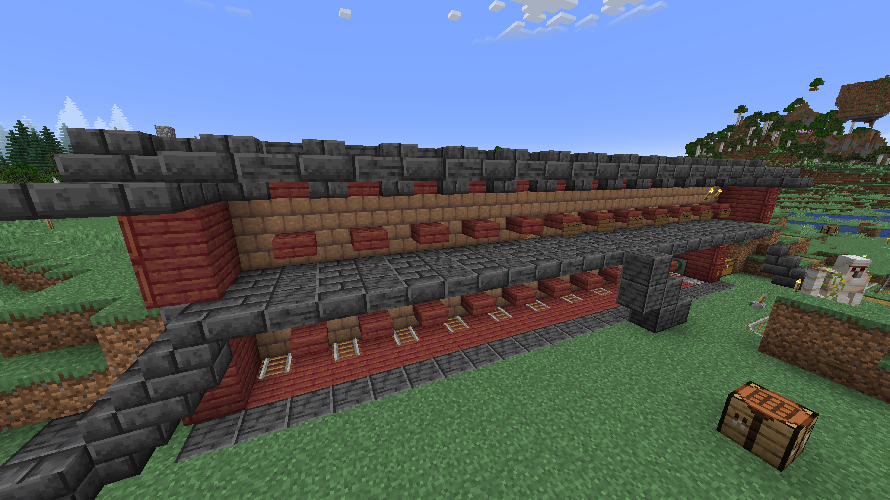

## The first ME system
After a few days of playing, Carst and Jesse had managed to get a basic ME system up and running. This was a huge improvement over the chests we had been using before. We were now able to store all our items in one place and easily access them. It was not perfect yet though, we had to upgrade all our storage disks EVERY DAY to keep up with the exponentially growing production of our farms. 

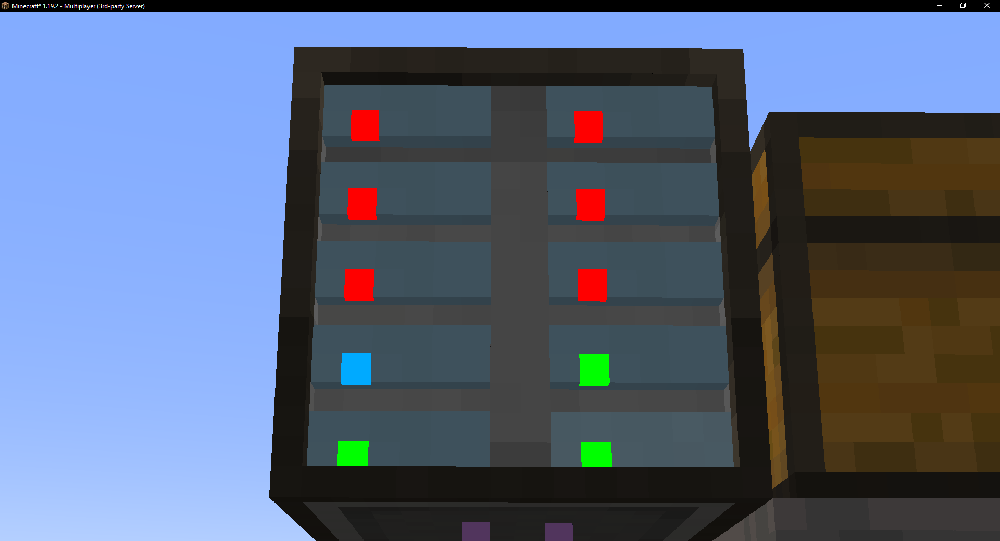

## Production of Emeralds
We were still struggling with the amount of emeralds our small farm was producing and it was time for an upgrade. The idea we had was to create a huge pumpkin farm and trade the pumpkins for emeralds automatically using the trading interface from [More Peripherals](https://www.curseforge.com/minecraft/mc-mods/more-peripherals). We started by designing a stackable module for pumpkins. We had to think of where the turtles would walk to harvest the pumpkins, how pumpkins growth time is affected by the amount of pumpkin stems next to eachother and how we were going to make sure all the pumpkin stems had a light level of 9 or higher. 

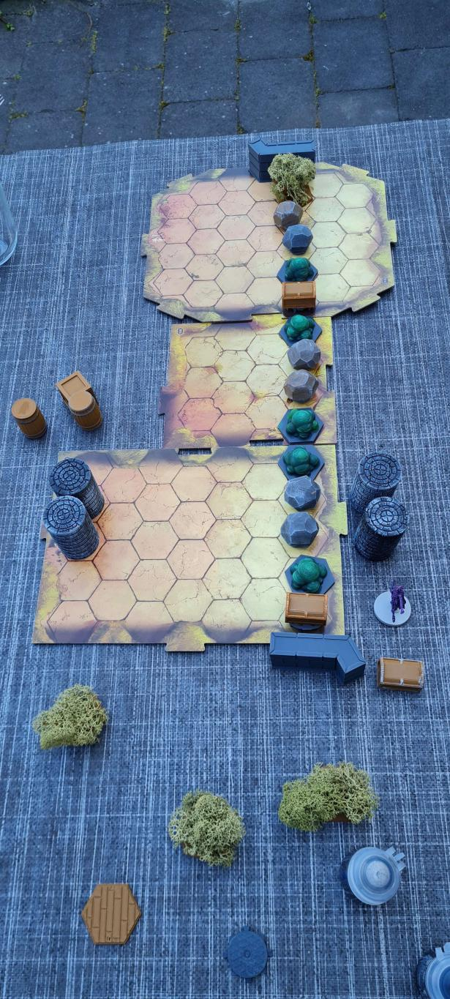

After we came up with a nice design, we had to come up with a location. We thought it would be cool to build a huge underground bunker for the farm. We made some plans and found out we had to mine 168 thousand blocks to make room for the 4 modules we were planning to build. This was definitely doable, but not without a instant mining using a haste 2 beacon. Which means we first had to construct a wither skeleton farm. We are able to manipulate spawners using the spawner interface from [More Peripherals](https://www.curseforge.com/minecraft/mc-mods/more-peripherals). This means we can make a wither skeleton farm without having spawnproof half the nether dimension. So we constructed the farm and after little time we looked like this:

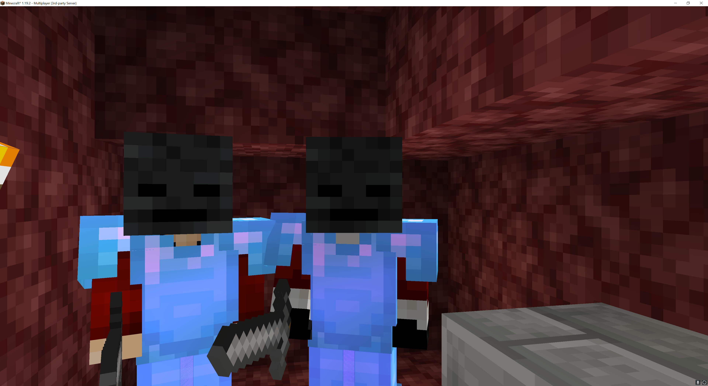

Now we were finally able to start mining. We came up with the idea to start by mining about 1/4 of the chamber and to first add one of the modules to get our emerald production up as quick as possible. So now we would be able to actually start construction of pumpkin farm, right? Wrong. We chose to build our using Frog Lights as the light block to light up all the pumpkin stems. This meant we first had to construct ANOTHER farm to get the frog lights. We decided to build a simple design from internet and after some time, we had our first frog lights. We could now finally start building the farm and after a long night of building, we had our first module up.

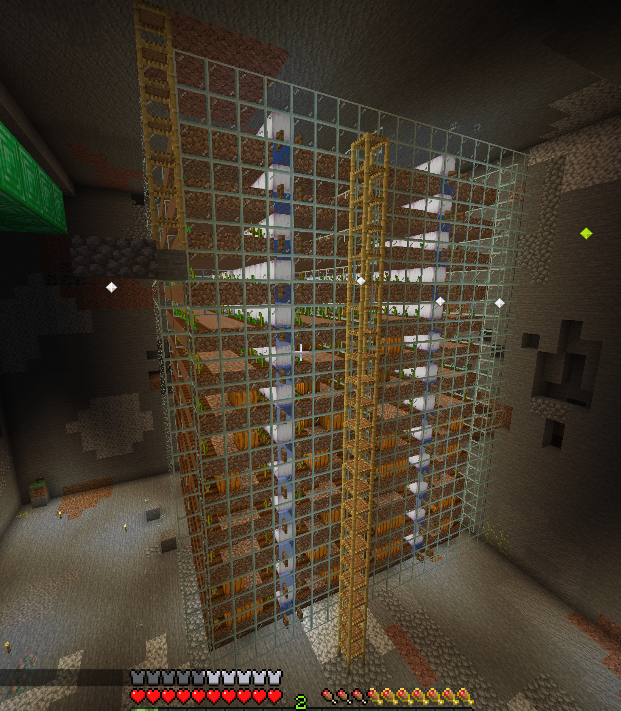

We still had to make designs for the room on our creative server. We needed things like a way to get up and down, a place for the computers which managed the farm and of course everything had to look a bit nice. I won't bother you with that too much though.
So now we would only have to mine and construct three more of these modules, easy right?

This is what the pumpkin farm looks like now. It consists of 4 big modules, which each consist of 4 smaller 8x8 towers. In total the farm contains 16 turtles, who all harvest their own part of the farm. The pumpkins are then picked up by the manager via modems from computercraft and traded into emeralds using the trading interface. The emeralds are then stored in the ME system and can be used by the players. The farm is able to produce about 15k pumpkins which is about 41,5 stacks (2,5k) emeralds per hour. This is a huge improvement over the 20 stacks per day we were producing before.
At this point in time we have over 600 thousand emeralds in our ME Storage. We are now able to buy anything without having to worry about running out of emeralds.

## Energy solution

While Josian and I were working on the pumpkin farm, Carst and Jesse were working on a better way to get power. Our ME system was growing rapidly, which caused the power demand to grow with it. We were still using a small reactor from [Big Reactors](https://www.curseforge.com/minecraft/mc-mods/big-reactors). The reactor was not enough anymore, so we had to come up with a better solution. Work started on a bigger reactor, but for this a lot of resources were needed including about 25k Iron Ingots. At this moment in time we were still mining iron by hand, which was not going to cut it. That's how this nice looking iron farm came to be.

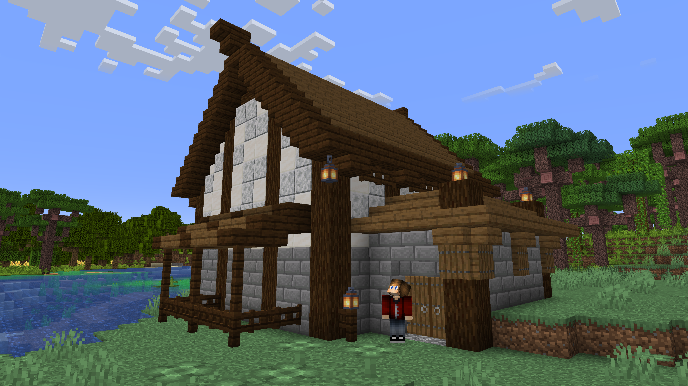

This amazing looking house build by Jesse, contains an iron golem spawner (again manipulated with the spawner interface from [More Peripherals](https://www.curseforge.com/minecraft/mc-mods/more-peripherals)). The iron golems are then killed by lava and the iron is stored in a mini ME system. We have firetick disabled on the server, because we didn't want to worry about lightning burning down the roof of our city hall again (yes, that happened). After a lot of afking, enough Iron was produced to build the new reactor.  
There is only one problem now, the reactor uses several stacks of yellorium per day. A resource that is added to the game by [Big Reactors](https://www.curseforge.com/minecraft/mc-mods/big-reactors). Currently we're still mining this by hand, but we are working on a solution to automate this process as well. The idea is that a miner turtle will mine the yellorium ore for us, but that's easier said then done. First of all, you need to load the turtle. You could do this by making it use a chunk controller peripheral. This would keep the chunk that the turtle is in loaded, however the turtle also needs a pickaxe to mine and a modem to be able to communicate to our systems and a turtle can only use two peripherals.  
The solution we came up with is to have an extra turtle high up in the sky in the same chunk, which will keep the chunk loaded. This turtle's position is then synced with the miner turtle, so that it keeps them both in the same chunk. This way the miner turtle can use a pickaxe and a modem and still have the chunk loaded. Carst is working on this project and is definitely making progress, I hope i'll be able to show you the results in the next newsletter. For now, we're using vibration chambers from [Applied Energistics](https://www.curseforge.com/minecraft/mc-mods/applied-energistics-2) to get the energy we need. These are powered by charcoal and produce about 80 RF/t each. We have 46 of these chambers, which for now is just enough to keep up with the power demand.

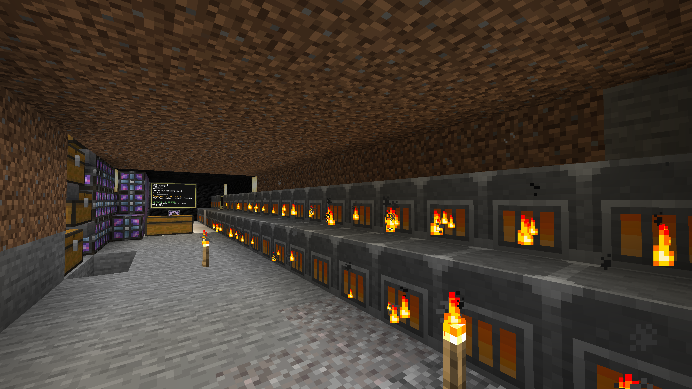

The vibration chambers need a fuel source to burn, like lava, coal or wood. Our turtles from the pumpkin farm are also in need of a lot of fuel, as they need one fuel point per movement. We decided to use charcoal as our fuel source for both these problems. One charcal is equal to 80 fuel points and is stackable to 64, instead of something like lava buckets which are only stackable to 1. This is very handy when working with turtles. We started doing some research into how fast trees grew and how much charcoal we could get from them. I was a afraid that 2 by 2 spruce trees would not drop enough sapplings to make the farm reliable, but I was wrong. From what I remember from our testing, the small trees dropped around 3.8 sapplings per sappling needed and the big trees dropped 1.8 per sappling needed. This was more then anough to keep our farm supplied. We also found out that the big trees grew an average of two times(!) faster then the small trees, which I was very suprised by. So we decided to build a farm that would grow big spruce trees. Here is the result.

It uses one turtle per every 6 trees and is very expandable. We are planning to stretch it all the way to the right and triple it in production when we have time for it. For now it's producing enough though. There is still an issue, we need to smelt the spruce logs to charcoal. Work started on a furnace array under the tree farm. This is what it looks like now.

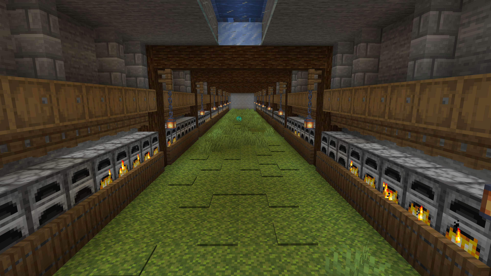

All the furnaces are connected with modems and are supplied with logs and charcoal by the manager computer. We currently have around 5.5 milion charcoal, so I would say the farm is working pretty good. The module you're seeing above, was not enough however, so next to it is another one. With the amount of furnaces we have now (256), we should be able to smelt over 2 milion logs per day, but the tree farm does not keep up with that (yet).

## Trading hall

In the mean time, I wanted to start working on a more permenant trading hall. The one we had now was just a temporary solution, so I started working on a new one. In the new trading hall, I wanted to connect all the villagers with trading interfaces to one manager, so that in the future, we can automate villager trading and do it remotely. I had to space out all the villagers by 2 blocks, because of an issue with the range of the trading interface ([#28](https://github.comJheffersonMarques/MorePeripherals/issues/28)). This issue was later fixed though. After some designing and building together with Jesse, this is what we came up with. (the outside is still under construction).

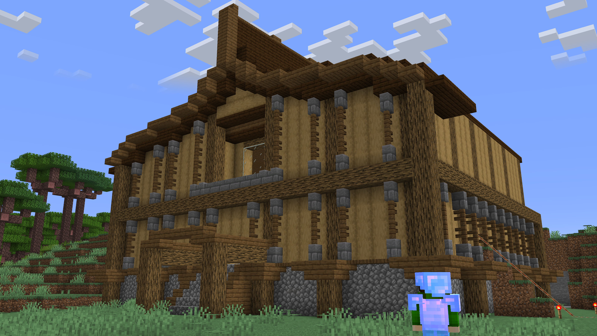

We still had to move all our villagers to the trading hall, which was a lot of work, but also hilarious. We set up a rail from the old trading hall to the new one, but things didn't go too smoothely. 

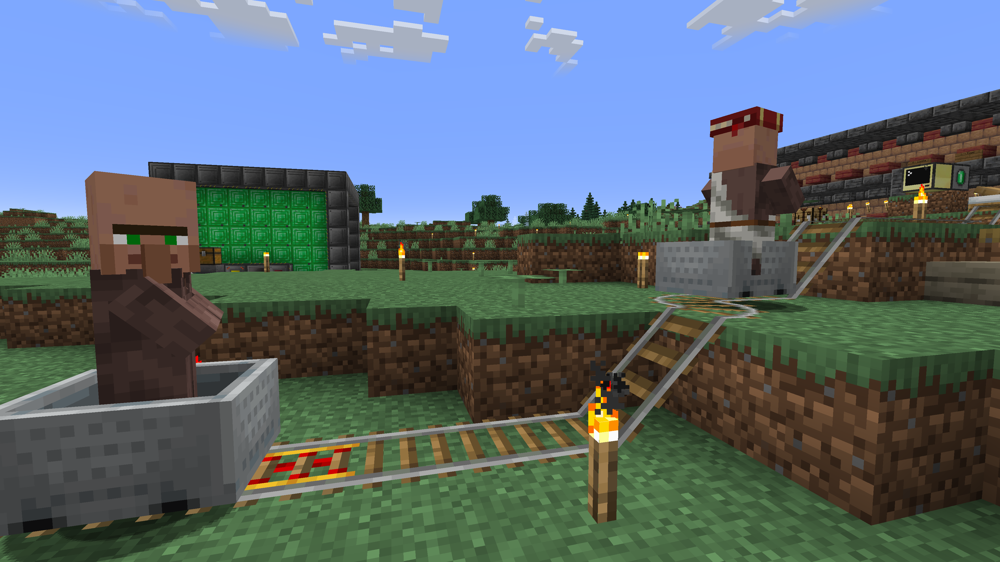

I may or may not have died for this picture:

In the end it was all worth it though, because the trading hall looks amazing.

The trading hall has multiple floors including a basement. Currently it has space for around 60 villagers, which should just be enough to get every trade we need (I hope). With the trading interfaces, we are able to trade and restock villagers automatically. Which means we can trade at rapid speeds. We should also be able to interact with anvils, which means we can completely automate the task of creating good gear. These are all plans for the future though. For now, we are just happy that we have a nice looking trading hall. Oh, and maybe that our villagers won't get killed by zombies anymore.

## ME System
With our farms growing rapidly, we were and still are in need of a bigger ME Storage. Jesse has been working on this and designed a really cool underground ME System. ME is definitely not my strong suite, but I'm gonna try to explain it as good as I can.  

The most important piece of the ME system are the ME drives, they can hold 10 ME storage cells, which provide us with a way to store items. One storage cell can hold up to 63 different items or over 2 million items of the same type. This means that this wall of storage should be able to store over 280 milion items of the same type.

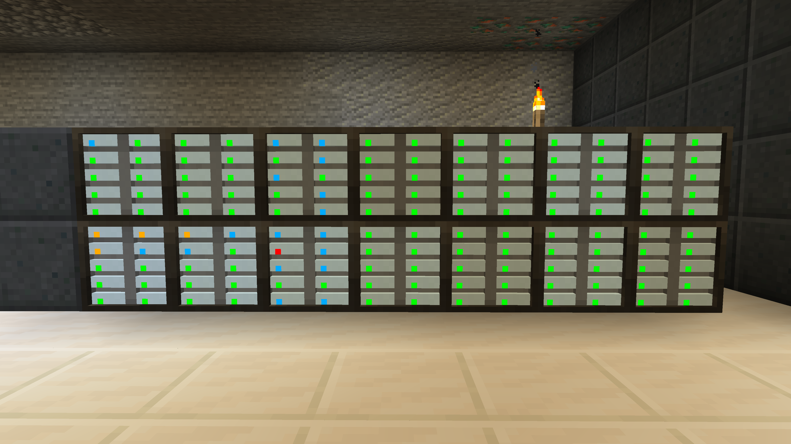

All these drives are filled with max level storage cells, which are a pain to craft. That's why Jesse has also been setting up autocrafting, also from [Applied Energistics](https://www.curseforge.com/minecraft/mc-mods/applied-energistics-2). To store a lot of big autocrafting jobs, you need a lot of processing units (I think). 

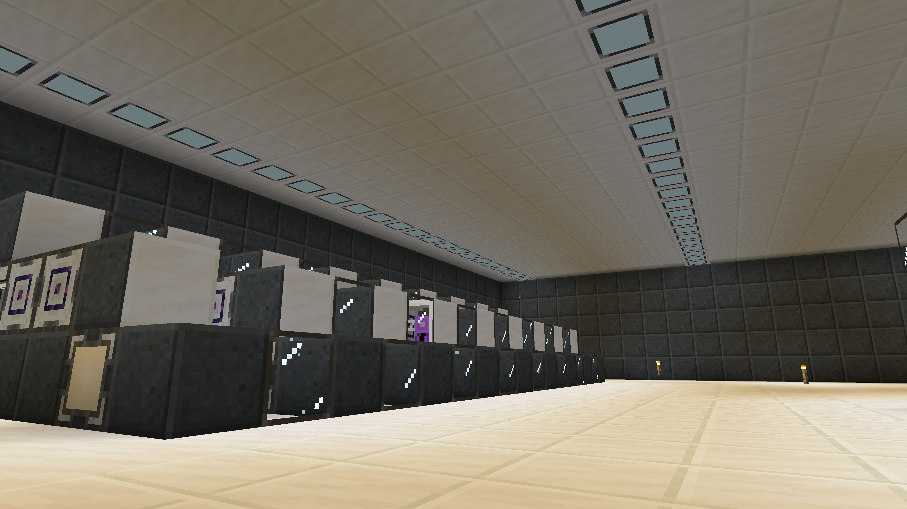

To be able to expand our autocrafting system to the next level, we need a way to automatically smelt items. We of course have a lot of charcoal and a furnace array at the tree farm, but the furnace array is too far away and already in use by the tree farm. So we decided to build a furnace array under the ME system. This is what it looks like now:

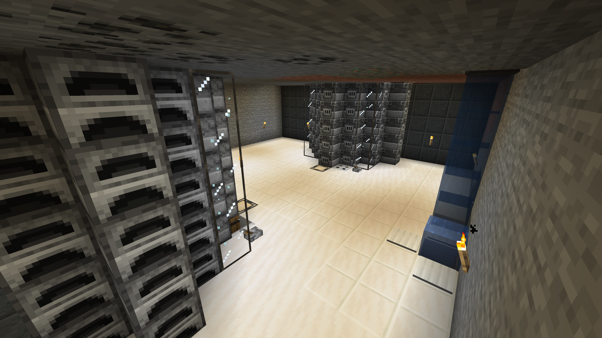

The ME autocrafting can push items into the chests under the modules. These chests are then emptied and distributed over the furnaces by a furnace manager computer. The furnaces use charcoal that's taken from the ME system to smelt the items. After the items are smelted, they are put into the pattern provider. The pattern provider is connected to the ME system and the ME takes the items out and uses them to complete the autocrafting job.

## Talented people
This project is more about just playing minecraft survival though. It's a project where every one can use their talents to make something amazing. For example, we have people that love building, 2D and 3D images, creating animations, we have people that love to create software and add a better solution everyday, we even have someone that can create clothing designs and even produce them! Here are some examples of what people have been working on.

#### 3D printed button (By Jesse)
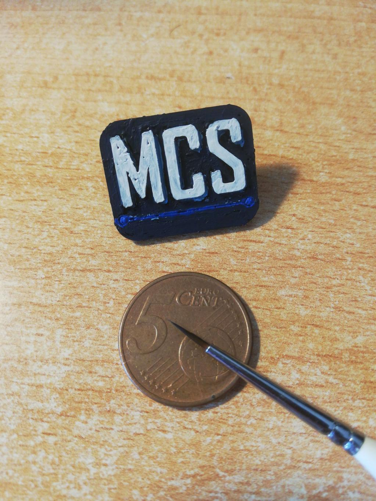

#### MCS Evolved T-Shirt (By Nienke)
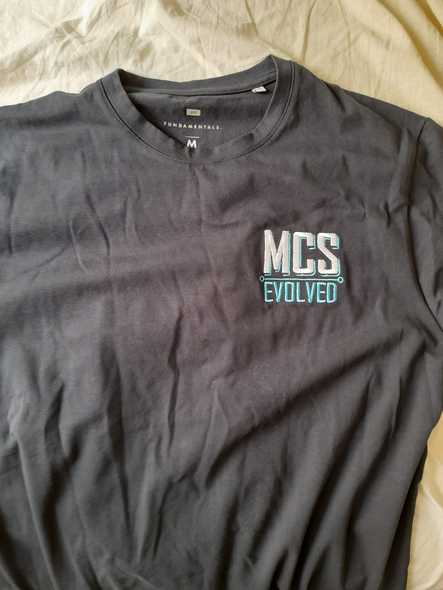

#### Emerald Exchange Logo (By Jesse)
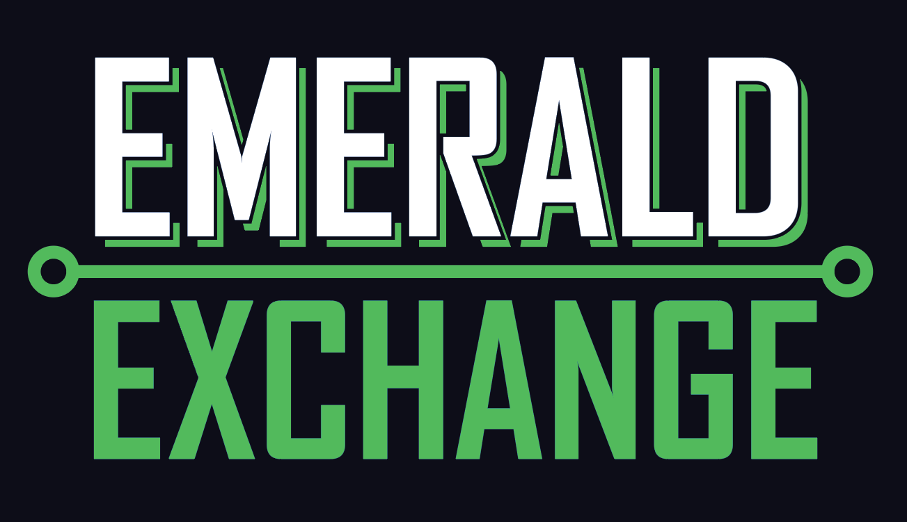

I personally love that we're able to do all these things together. It's amazing to see what people can do and I'm very proud of everyone. I'm sure we're gonna see a lot more amazing things in the future.

## MCS remotely
One of the big things that MCS consists of is the concept of controlling and monitoring everything on the minecraft server remotely. From mobile to web to your TV and your google assistant, the plans are everywhere. 

### Hosting
The first thing we had to get out of the way was our way of hosting all our services and frontends. We decided to go with firebase as our static file hosting. Currently it doesn't host much yet but it will host the frontend's for all services (for web ofcourse). We chose to host our backend servers on the same dedicated computer that the minecraft server is hosted on, this way we have more control over it.

We needed a way to be able to launch new services to the dedicated pc easily. As it's located at Carst his house, we can't just go there and launch a new service. Carst decided to create an admin panel that allows us to create new services and launch them. This is what it looks like now. 

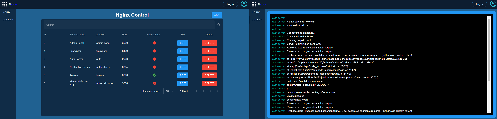

It's still very basic, but it works. It allows us to create new services by uploading a docker compose file. It automatically pulls the image that's called in the compose file from the registry. It also allows us to add the service to the nginx proxy, which enables us to access the service from anywhere on the api.mcsynergy.nl domain. 

### Mobile app
Being able to create services is cool, but nobody can live without their phone. As Josian is currently enrolled in a mobile development course at school, he decided to create a mobile app for MCS. He is busy developing a version for Android and iOS and is making good progress. The app can already send you push notifications about the things you're subscribed to!

I have already seen a lot of amazing looking designs, but i'm not going to be showing those off just yet. But I do recommend you to keep an eye out.

### Authorization
We need a way to protect our services from unauthorized access and a way to seperate guests from players and admins. After A LOT of discussions about what this should look like. We decided to use firebase as our auth provider.

Authorization for MCS needs a few things:

- A way to seperate guests from players and admins and protect services from unauthorized access.
- A way for services to communicate with other services, by getting a service token.
- A way for the minecraft server to communicate with services. 

Authenticating people is pretty easy with firebase. We can just use the firebase auth sdk to authenticate people and get their token. We can then use that token to authenticate user's at our services. But seperating those users into guests and players is a bit more difficult. Firebase doesn't really provide a solution for this. We decided to use custom claims for this. A custom claim is a piece of data on a token that tells something about the user. We can use this to tell if a user is a guest or a player. To add custom claims to a token, we need to use the firebase admin sdk. Which meant we needed to create a service that would handle this for us. So the auth server came to life. After registering a user, the token can be send to the auth server, which will add the necessary claims to the token. The token can then be send back to the client, which can then be used to authenticate at other services. 

Now that we can authorize users, how are we going to authorize services? We needed a way to prove that a service was indeed a service, before providing it with a token to identify itself to other services. We decided to use a service account for this. This enables all the services to create a custom token which they can send to the auth server for verification. The auth server will then verify the token and send back an IDToken to be used for authorization at other services.

Now that we can authorize users and services, we need a way for the minecraft server to authorize itself. We decided to create a long password for the minecraft server, which it can use to authenticate at the auth server. This way we can make sure that only the minecraft server can authenticate as the minecraft server. The auth server can then provide the minecraft server with a token, which a token manager computer can spread to the other computers on the minecraft server.

### Tracking turtles and systems
We have a lot of turtles and systems on the minecraft server. We want to be able to track them and see what they're doing. We also want to be able to control them remotely. Josian has been working on a tracker for this. It's currently only a backend server, but a frontend is coming soon. The tracker is able to receive logs from systems (farms an other technical systems on the minecraft server) and services, but it can also receive information like locations, fuel levels, inventory data, etc. 

To be able to easily send logs from all our services, I have been busy creating a logger package for .NET Core. This package allows us to easily send logs to the tracker and not have to worry about authorization. I'm planning on creating one for Javascript as well, but I haven't gotten around to that yet.

### Future plans
We have a lot of plans for the future. Some things we want to do are:

- Create a frontend for the tracker.
- Allow the mobile app to control turtles and systems.
- Building a solution for automatically trading with villagers 
- Finishing the miner turtle
- A power management system
- Overview page for MCS
- A blog for MCS

This will be the end of the first news post. I hope you enjoyed reading it. If you have any questions, feel free contact us. If you want to stay up to date with MCS, you can follow us on [Instagram](). A lot has happened in a month time and I am not able to fit everything we did in this post. So here are some more images of things we have been working on.

Our bee farm:
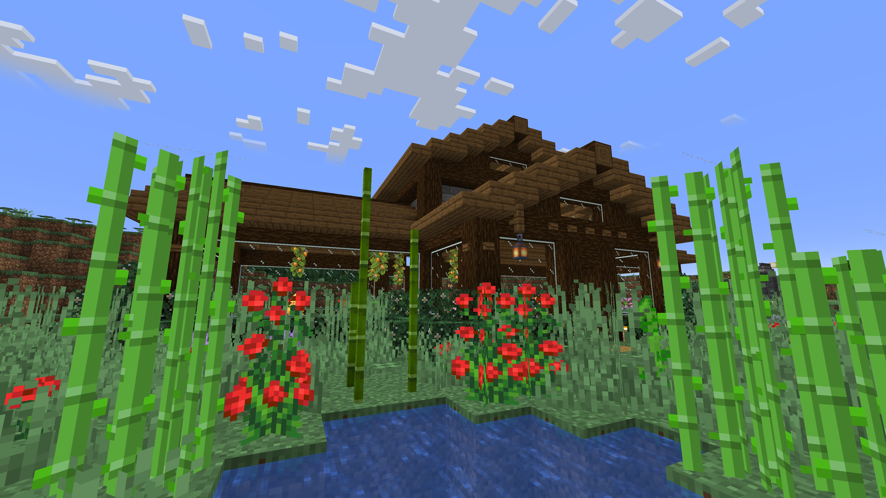

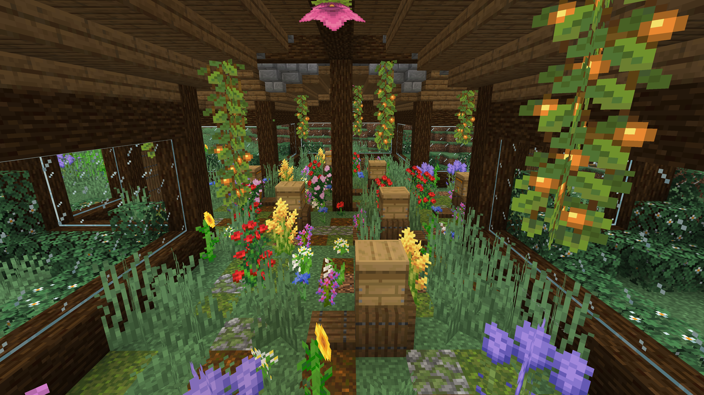

An energy monitor and handler, which supplies the vibration chambers with exactly enough fuel to match our energy need:

Goldfarm with looting 3, because of the grinder from [more peripherals](https://www.curseforge.com/minecraft/mc-mods/more-peripherals):
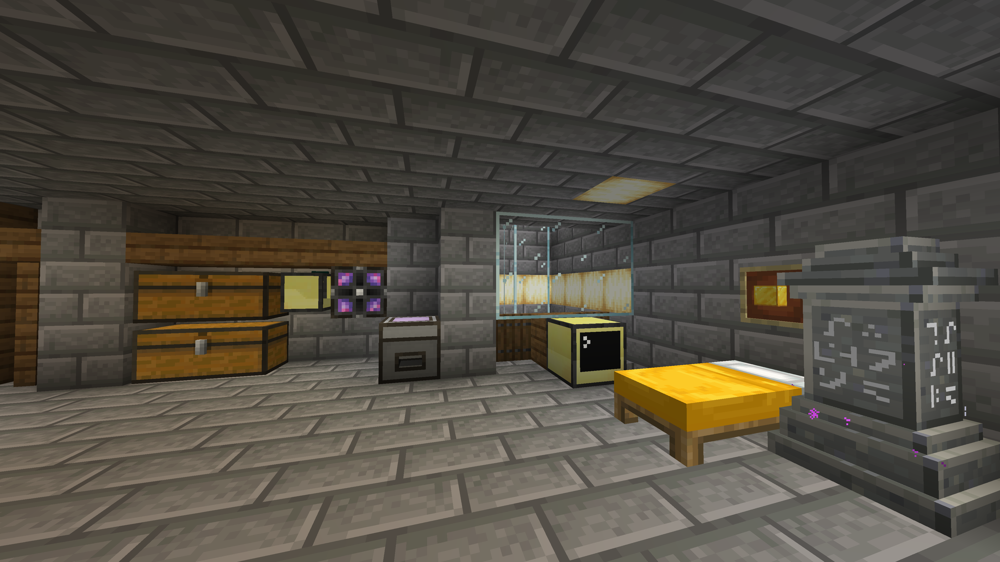

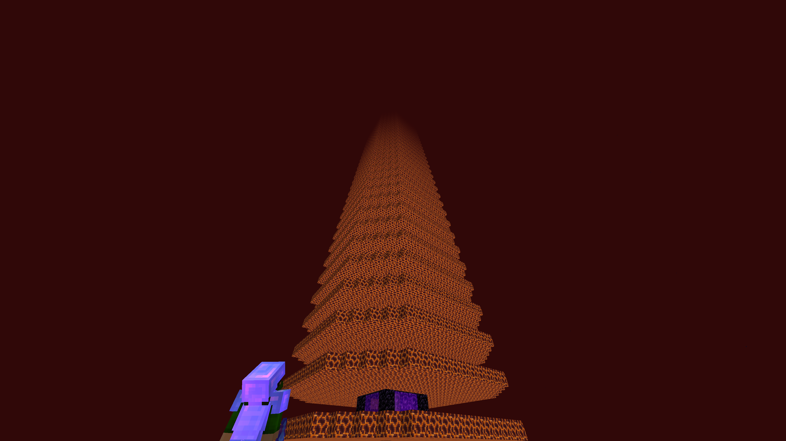

